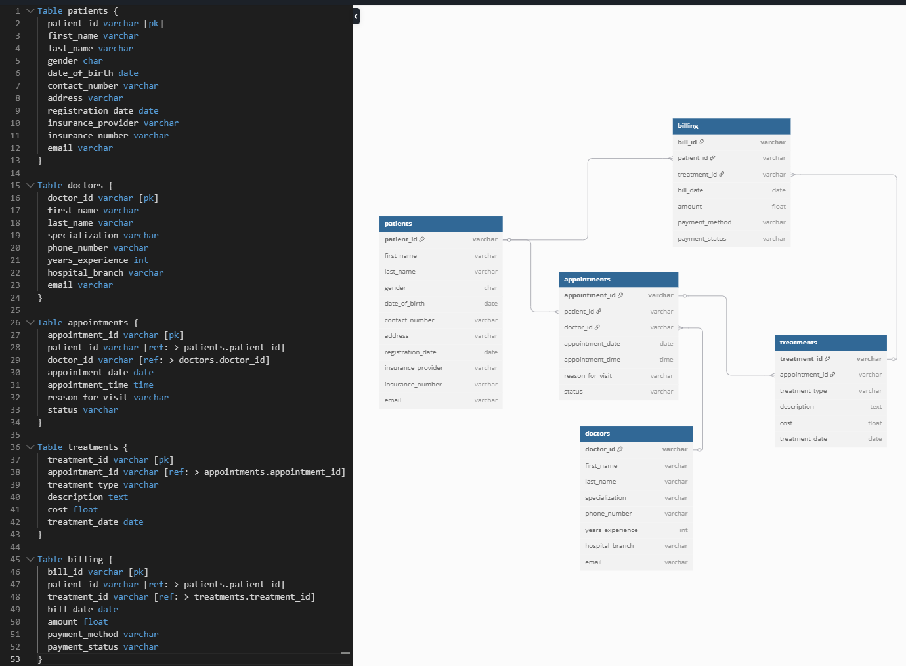
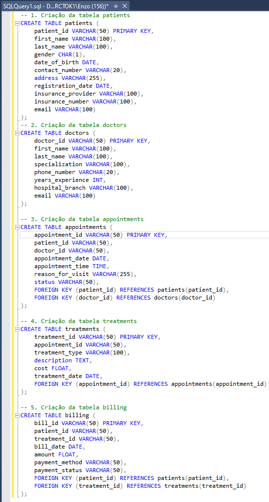

# 🏥 Inovamed - Healthcare Analytics
---
## 🔹 Sobre o Projeto

Este projeto tem como objetivo demonstrar habilidades práticas em **Engenharia de Dados** e **Análise de Dados** por meio do **processamento, modelagem e visualização** de informações provenientes de cinco planilhas distintas relacionadas a um hospital fictício, o **Inovamed**.

A proposta consiste em aplicar técnicas de **ETL (Extração, Transformação e Carga)**, criação de um **modelo relacional em SQL Server**, e construção de **dashboards analíticos no Power BI** que respondam a perguntas de negócio relevantes para a gestão hospitalar.

Com isso, buscamos transformar **dados brutos** em **informações estratégicas confiáveis**, que auxiliem na **tomada de decisão orientada por dados**.

## 📊 Tecnologias Utilizadas

- Python (ETL e pré-processamento)
- Pandas (Transformação e exportação)
- SQL Server (modelagem relacional + criação de views)
- Power BI (dashboards interativos)
- Git/GitHub (versionamento e portfólio)

---

## 🧩 Estrutura dos Dados

O projeto trabalha com 5 datasets principais que foram baixados do KAGGLE, são estes:

- **patients.csv** – Dados demográficos e de cadastro de pacientes
- **doctors.csv** – Especialidades e experiência médica
- **appointments.csv** – Agendamentos, status e motivos das visitas
- **treatments.csv** – Tipos de tratamento, custos e datas
- **billing.csv** – Faturamento, métodos de pagamento e status

Esses arquivos foram tratados, relacionados e inseridos no SQL Server. Views otimizadas foram criadas para facilitar a análise via Power BI.

---

## 🌱 Passo a Passo do Projeto

#### Após o dowload dos datasets, é o momento de entender nossas estruturas de dados, onde vamos modelar e planejar os relacionamentos que as tabelas irão possuir

### 🔹 Modelagem de Dados
- Esse passo da modelagem é primordial para entender os dados e criar as possíveis tabelas de relacionamento que serão criadas no decorrer do projeto.
- Site utilizado: **dbdigram.io**

### 🔹 Processo de ETL
- Após o mapeamento dos dados chegou a hora de executar o processo de ETL.
- Foi optado por usar a **Arquitetura Medallion**, a camada Bronze é o início dos dados, camada Prata para dados limpos e a camada Gold a conexão do SQL Server com as VIEWs.
- O ponto inicial foi deixar os datasets na camada BRONZE para assim começar as modificações
- Logo em seguida foi executado uma pipeline de dados onde aplicava o processo de **TRANSFORMAÇÃO** dos dados.
  - O arquivo da transformação .ipynb se encontra no repositório, mas em resumo foram alterados: Tipo de dados, criação de novas colunas com extração de valores.
  - Após a transformação os datasets foram salvos na camada PRATA.
- Com os dados na camada PRATA, chegou o momento de fazer o **LOAD** para nosso banco de dados no SQL Server.

### 🔹 Load para o Banco de Dados (SQL Server)
- No SQL Server foi criado o Database, logo em seguida foi criado as tabelas por meio de Queries (imagem abaixo)
- Após a criação das tabelas precisamos realizar a conexão Python -> SQL Server
  - Com conexão bem sucessida foi hora de executar nossa função e realizar o LOAD para nosso banco de dados

### 🔹 Dados no SQL Server
- Com os dados inseridos no banco de dados, chegou a hora de criarmos views para facilitar nossa análise no Power BI
- Views criadas, agora partiu Power BI

### 🔹 Conexão Power BI
- Realizado a conexão entre PowerBI -> SQL Server
- Carregamento das views, o carregamento foi direto porque os dados já se encontravam "LIMPOS e FORMATADOS"

 ### 🔹 Criação de Dashboard para Visualização com PowerBI
- O Dashboard foi divido em 3 páginas onde abordamos: Visão Geral, Financeiro e Atendimentos
- 📄 Veja o dashboard completo em PDF:

---

## 💼 Perguntas de Negócio Respondidas

O painel do Power BI foi desenvolvido para responder a perguntas estratégicas para a gestão da Inovamed, como:

✅ **Qual mês que mais faturou?**  
↳ O mês com o maior faturamento foi Abril com R$ 64.271,54.

✅ **Qual o tipo de tratamento que mais gera receita?**  
↳ O tipo de tratamento que mais gera receita é do tipo: Chemoterapy (Quimioterapia), representando 23,38%.

✅ **Quais médicos geram mais receitas?**  
↳ Os 3 médicos mais "valiosos" são: Dra Sarah Taylor, Dr Alex Davies, Dr David Taylor.

✅ **Quem são os pacientes que mais geram receitas?**  
↳ Os 3 pacientes que mais geram receitas são: Michael Taylor, Michael Wilson e Laura Davis.

✅ **Qual plano de saúde gera maior receita?**  
↳ O plano que representa a maior porcentagem de receita gerada é o HealIndia com 33,34%.

✅ **Qual a faixa etária dos meus pacientes?**  
↳ A média da faixa etária esta em 45 anos.
 
✅ **Com os pacientes que não aparecem, quais os motivos?**  
💬 Apesar da ausência de uma coluna direta com o motivo, a estratégia adotado poderia ser envolver o setor de SAC, com isso criar uma nova tabela de dados onde estariam esses dados.

📌 *Sugestão futura*: apoiar o setor de SAC com pesquisas de satisfação para investigar possíveis objeções — como dúvidas sobre o tratamento, percepção de preço ou insegurança.

---

> 🔎 *Este projeto utiliza dados fictícios, gerados para fins educacionais. Nenhuma informação real de pacientes foi utilizada.*

